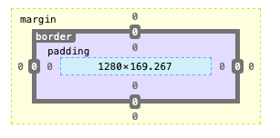

# Section 02 | CSS Basics #

In this section we will be learning about:-
* Implementing CSS
* Using Selectors
* Fonts, Color, etc
* Backgrounds & Borders
* Box Model / Margin and Padding
* Floating and Alignment.
* Display Property
* Link and Button Styling
* Creating Menus
* Positioning
* Form Styling
* Dev Tools

## CSS Basic ##
* CSS is required to make the web page beautiful. HTML is structure, CSS is Style.
* CSS can be added to an HTML Document in 3 ways.
    - In-line CSS : We can add CSS property directly to HTML elements. This is not a preferred way to include CSS.
        + `<h1 style="color : red;">`
    - Internal CSS : We can add CSS within the `<style>` elements in the HTML file. We can grab the element to style.

````css
<style>
    /* Internal CSS */
    h2{
        color:green
    }
</style>
````


* External CSS : We can add an external file, named `style.css` and then include this file within the HTML by using `<link>` element.
    + `<link rel="stylesheet" href="css/style.css">`
    + This is the most preferred way to include CSS into HTML.

## Basic CSS Selector ##
* There are multiple ways to target element in HTML for styling.
* **Element Selector** : The most basic is an element selector.
    - The below is an example of element selector.

````css
body{
    color : white;
}
````

* **Class Selector** : We can assign common styling applicable to a common group called class.
    - We can apply the class to multiple HTML element to style them in same manner.
    - `.` is used in CSS to identify a class.

````html
<h2 class="primary-heading">Welcome</h2>
````


````css
.primary-heading{
        color: green;
    }
```` 

* **ID Selector** : We can assign an ID to a specify element to style it uniquely.
    - We should have only 1 ID per HTML page.
    - `#` is used in CSS to identify a ID.

````html
<div id="welcome">
```` 

````css
#welcome{
        background-color: #f4f4f4;
    }
````

* **Multiple Selector** : We can assign same CSS property to multiple class.
    - `,` is used to specify multiple class, sharing same CSS property

````html
<div id="welcome"></div>
<div id="about"></div>
````


````css
#welcome, #about{
        border: 1px solid #ccc;
        padding: 10px;
        margin-bottom: 5px;
    }
````

* **Nested Selector** : We can also specifically target a particular element in the HTML hierarchy.
    - ` ` is used to specify nesting.

````html
<div id="welcome">
    <p> HELLO </p>
</div>
````

````css
#welcome p{
        font-size: 20px;
    }
````


## CSS Fonts ##

* **Web Safe Fonts** : When using different `font-family` in CSS, we have to take care that the font should be available in all the system.
    - `font-family` : `Arial, Helvetica, sans-serif;` this means that `Arial` will be selected, if not present `Helvetica` will be selected, at last any `sans-serif` font will be selected.
* **Downloaded Fonts** : There is also option to use Internet fonts like google fonts, adobe fonts.
    * `<link href="https://fonts.googleapis.com/css?family=Roboto&display=swap" rel="stylesheet"> `
        * The above will link to a `Roboto` font from google fonts and it is free.
* Measurement Unit:-
    * Absolute:-
        *  `cm` : centimeters
        *  `mm` : millimeters
        *  `in` : inches
        *  `px` : pixel, this is what is most commonly used.
        *  `pt` : point
        *  `pc` : picas
    +  Relative:-
        *  `%` : Relative to parent element.
        *  `em` : Relative to the font size of the element.
        *  `rem` : Relative to the font size of the root element.
        *  `vw` : 1% of the viewport width
        *  `vh` : 1% of the viewport height.
-  `font-size` : based on the above measurement units.
-  `font-height` : how tall will be the font
-  `font-weight` : `bold`, `italic`

## CSS Colors ##

* There are multiple ways to specify color in CSS.
    - Color Names : We can specify the color names like `red`, `white`.
    - RGB values : We can specify the rgb values with `rgb(red, green, yellow)`
        + the value have a range of 0 - 255 for each red, green and yellow values.
    - HEX Values :  We can also specify the rgb value using HEX value like `#dddddd`
        + The Six values are divided into, first 2 values for Red, next 2 for green, and last 2 Blue.
        + We can also specify only 3 values. 

## Background and Borders ##
* `background-color` : Specify a background color and a element.
* `border-width` : The width of the border.
* `border-color` : The color of the border.
* `border-style` : The style of the border, like `dashed`, `solid`
* `border: 3px chartreuse solid;` In place of specifying the above 3 property we can give it in this one line.
* `border-radius` : we can specify the border radius in CSS3.
* `background` : This is a shorthand CSS property to set all background style properties at once.
* `border-top` : We can also specify only one border direction, like `top`, `left`, `right` or `bottom`.
* `border-top-left-radius` : We also specify just the `top` `left` border radius.
* `background-image` : It sets one or more background images on the element.
* `background-repeat` : CSS property sets how the background image are repeated.
    - Horizontal or Vertical or not repeated at all.
* `background-position` : CSS property sets the initial position for each background image.
* `background-size` : It sets the size of the background image, `cover` is the value which does not stretches the image.
* `background-attachment` : If the background


## Box Model ##

* CSS Reset:-
    - There is default margin, padding and other CSS property defined by the browser, we can override it by using the CSS Reset like this.

````css
*{
    margin: 0;
    padding: 0;
    box-sizing: border-box;
}
```` 

* `box-sizing: border-box;` : When we specify the width of a element, and in addition to that specify the margin and padding, then due to `content-box` being the default `box-sizing` value it will add to the width both margin and padding.
    - If that is not the required behavior then change it to `border-box` then everything will be included in the `width.`
* Box Model : The box model as shown in browser.



* Padding : As shown above it is the space between the border and the content.
    - We can specify Padding in multiple ways.
    - Padding per side.
    * Padding shorthand.
        * `padding: 10px 20px 10px 20px;` : top, right, bottom, left
    * Even more shorthand, since the values are common  
        * `padding: 10px 20px;`  : top/bottom, left/right

````css
padding-top: 10px;
padding-right: 20px;
padding-bottom: 10px;
padding-left: 20px;
````


    
* Margin : As shown above it is the space outside of the border.
    - We can also specify margin in multiple ways.
    - Margin per side
    - Margin Shorthand
        + `margin: 10px 20px 10px 20px;` : top, right, bottom, left
    - Even more shorthand, since the value are common.
        + `margin: 10px 20px;` : top/bottom, left/right

````css
margin-top: 10px;
margin-right: 20px;
margin-bottom: 10px;
margin-left: 20px;
````


    
## Float & Align ##
* Align
    - Center aligning is very essential in the new world. We can use these 2 property to center align.
    - `width: 960px;`
    - `margin: auto;` These 2 property help in center align of the content.
    - `max-width: 960px;` : we can use max-width if we want responsive centering.
* Text Align:-
    - There are multiple text align property
    - `left` : this is the default.
    - `right` : this is for right align.
    - `center` : this is for center align.
    - `justify` : this is to justify alignment.
* Floating : 
    - We can float to div using the `float` and `width` property. 
    - We should also have the `box-sizing` property set else the dimension will be wrong.
* Clear Float :
    - We should always clear float by using `clear:both` property.

## Link and Button Style ##

### Link Style and State ###
* Links have different ways to style themselves, along with states.
* `text-decoration: none;` : removes the under line from the link type.
* We can style the links based on the state, which is done with the help of pseudo selector.
* The different states are:-
    - `hover` : when we move the cursor on it.
    - `visited` : when we visit and come back to the same page
    - `active` : when the link is clicked.

### Button Style and Links ###
* We can make both Links and Button look the same way.
* Here is a sample BTN class

````css
/* button styling */
.btn{
    background: #4c6ca0;
    color: #fff;
    border: none;
    font-size: 16px;
    padding: 10px 20px;
    border-radius: 5px;
    cursor: pointer;
}
.btn:hover{
    color: #f4f4f4;
    background: #446190;
}
````

## Navigation Menu and Sidebar ##
* The navigation menu and Sidebar are 2 important menu techniques in CSS.
* `.side-menu li:last-child` : Sometime we want the last element of a list to be styled differently, we can use the `last-child` property to target that particular element.
* `list-style: none;` : removes the bullets in the list element,
* `line-height: 2.4em;` : puts space between 2 `li` elements if targeted for `li`.
* `overflow: auto;` : This expands to background to the shape of the content when the overflow property is set.

## Display Property ##
* Each HTML element have a default display behavior associated with itself. 
    - Like, `li` is a block element, `img` is an inline element.
* Block Level element means, it takes the complete horizontal width of the browser
* Inline elements only take as much space as it is required by the content.
* We can change this behavior from CSS.
    - `img` can be made an block level element by just setting `display: block;`
    - `li` can become an inline element by just setting `display: inline;`
* In-line elements:-
    - In-elements does not have any impact with width and margin set as auto.
* Block elements:-
    - We can control width, height and all other geometric property.
* Inline-block:-
    * This is to make inline element respond to width, hight and other similar property.
    * Inline-block makes the content only that much in width as required by the content, placing the next element right next with the padding and margin honored.
* `box-sizing`: Setting the box-sizing as border-box, helps in adding the padding and margin in the calculation of width.

## CSS Position ##
There are total of 6 CSS Position type.
* `static` :
    - This is the default set by CSS, we do not have to set it. 
    - This should only be set if the position was changed previously and we want to change it to static.
    - The value of `top`, `left`, `right`, `bottom` and `z-index` has no impact on this position.
* `relative` : 
    - This position does not move the element out of the document flow.
        + This means that the next element after an relative element will come at the same position irrespective of the current element position.
    - The value of `top`, `left`, `right`, `bottom` and `z-index`, moves the element that many position from where it was originally supposed to be present.
* `absolute` :
    - `absolute` position moved the element out of the document flow.
        + The next element come immediately after the previous element as though the current element was not present at all.
    - The value of `top`, `left`, `right`, `bottom` and `z-index`, moves the element based on the parent elements.
* `fixed` :
    - `fixed` also removes the element out of the document flow.
    - The position remains constant to the present document flow, as and when we scroll, the position still remains same.
    - The value of `top`, `left`, `right`, `bottom` and `z-index`,  decides where the element will be positioned.
* `sticky` :
    - It does not remove the element from the normal flow of document.
    - The element moves along with scroll, and behave like `relative`, once the scroll goes beyond a certain point it get fixed at the location mentioned.
    - The value of `top`, `left`, `right`, `bottom` and `z-index`,  decides where the element will be positioned.
* `inherit` :

### Reference for CSS Position ###
* [MDN | CSS | position ](https://developer.mozilla.org/en-US/docs/Web/CSS/position)
* [CSS-Tricks | Position ](https://css-tricks.com/almanac/properties/p/position/)
* [CSS-Tricks | Abs Vs Relative ](https://css-tricks.com/absolute-positioning-inside-relative-positioning/)

## CSS Visibility, Order and Negative Margin ##
* We can control the visibility of a element in these 2 ways.
    * `display: none;` - removes the element from DOM.
    * `visibility: hidden;` - Does not remove the element from DOM, just makes it hidden
+ CSS has a precedence order, like class has preference over element styling.
    * We can change it by using the `!important` flag.
+ Negative Values.
    * We can even give negative Values for margin, padding, which means before the current position.


